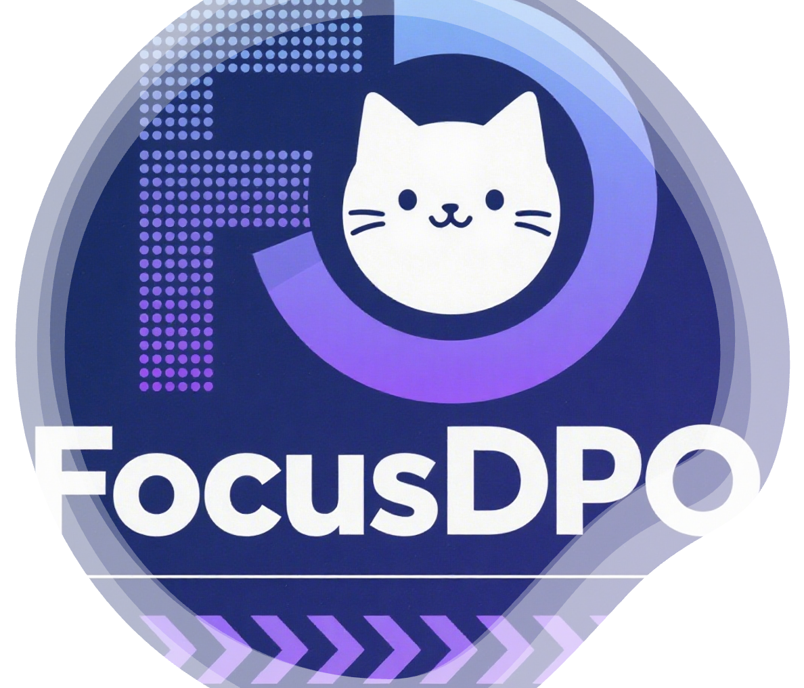

<h3 align="center">
    
    FocusDPO: Dynamic Preference Optimization for Multi-Subject Personalized Image Generation via Adaptive Focus
</h3>

 

>
 Qiaoqiao Jin*, Siming Fu*, Dong She*  Weinan Jia, Hualiang Wang,  Mu Liu, Jidong Jiang+</a>  
>Fanqie AI Team, ByteDance

## 🔥 News
- [09/01/2025] 🔥 The arXiv [paper](https://arxiv.org/abs/2509.01181) of FocusDPO is released.
- [08/20/2025] 🔥 The [project page](https://bytedance-fanqie-ai.github.io/FocusDPO/) of FocusDPO is created.

## 📖 Introduction

We introduce <b>FocusDPO</b>, a post-training framework that adaptively identifies focus regions based on dynamic semantic correspondence and supervision image complexity. FocusDPO demonstrates capabilities in single-subject and multi-subject driven generation tasks.

FocusDPO introduce <b>spatially-aware optimization framework</b> (left) that adaptively focuses on critical regions through dynamic semantic guidance, leveraging (a) Structure-Preserving Attention Field, which establishes robust correspondence mappings between generated and reference subjects, and (b) Detail-Preserving Complexity Estimator, which provides the semantic complexity of images.

## 🚀 Updates
To support research and the open-source community, we will release the entire project—including datasets, inference pipelines, and model weights. Thank you for your patience and continued support! 🌟
- [x] Release arXiv paper
- [x] Release GitHub repo
- [ ] Release Hugging Face Space demo
- [ ] Release inference code
- [ ] Release model checkpoints
- [ ] Release training code
- [ ] Release DIP dataset
